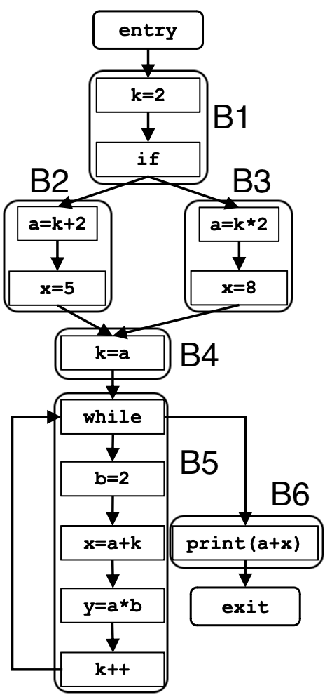

# Data Flow analysis: Constant Propagation

### Problem Definition:

- Determine at which points in the program the variables have a constant value
- Calculate for each node of the CFG a set $\space\lt var, const \gt$

### Motivation:

- allows the compiler to replace variables with constant values throughout the program, thus potentially eliminating redundant operations, leading to improved performance.

<br>

**_Note:_** The constant propagation analysis can determine the constant value of binary expressions where one or both operands of the RHS are known.

<br><br>

<center>

# Framework:

|                           |                        **Constant Propagation**                        |
| :-----------------------: | :--------------------------------------------------------------------: |
|          Domain           |                      set of $\lt var, const \gt$                       |
|         Direction         | Forward:<br>$out[B]=f_B(in[B])$ <br> $in[B]=\wedge\space out[pred(B)]$ |
|     Transfer Function     |               $f_B(in[B])=gen[B] \cup (in[B] - kill[B])$               |
| Meet Operation $(\wedge)$ |                 $\cap\space\rightarrow$ Intersection            |
|   Boundary Conditions    |                        $out[ENTRY] = \emptyset$                        |
|  Initial Interior Points  |                             $out[B_i] = U$                             |

</center>

<br><br>

# Iterative Algorithm:

```python
input = CFG(N,E,ENTRY,EXIT)

# Boundary Condition:
out[ENTRY] = ∅

# Init Steps:
for each BB except ENTRY:
    out[B] = U # Universal Set

# Iteration:
while(changes to any out[] occur):
    for each BB except ENTRY:
        in[B] = ∩(out[p]) for all predecessors p of B
        out[B] = gen[B] U (in[B] - kill[B]) # transfer function

# If reached = Convergence
```

<br>

<center>

# Example:



<br>

</center>

---

<br>

<center>

### Boundary Condition :

|  Basic Block  | Data representation |
| :----------: | :-----------------: |
| $out[ENTRY]$ |     $\emptyset$     |
|   $in[B1]$   |          -          |
|  $out[B1]$   |         $U$         |
|   $in[B2]$   |          -          |
|  $out[B2]$   |         $U$         |
|   $in[B3]$   |          -          |
|  $out[B3]$   |         $U$         |
|   $in[B4]$   |          -          |
|  $out[B4]$   |         $U$         |
|   $in[B5]$   |          -          |
|  $out[B5]$   |         $U$         |
|   $in[B6]$   |          -          |
|  $out[B6]$   |         $U$         |
|  $in[EXIT]$  |          -          |

</center>

<br>

<center>

### First Iteration:

|  Basic Block  |                                                                                                Data Output                                                                                                |
| :----------: | :-------------------------------------------------------------------------------------------------------------------------------------------------------------------------------------------------------: |
| $out[ENTRY]$ |                                                                                                $\emptyset$                                                                                                |
|   $in[B1]$   |                                                                          $in[B]=\wedge\space out[pred(B)]\rightarrow \emptyset$                                                                           |
|  $out[B1]$   |                                                $f_B(in[B])=gen[B] \cup (in[B] - kill[B]) \rightarrow \\{(k,2)\\}\cup (\emptyset - \\{k\\}) = \\{(k,2)\\}$                                                 |
|   $in[B2]$   |                                                                                               $\\{(k,2)\\}$                                                                                               |
|  $out[B2]$   |                                                               $\\{(a,k + 2),(x,5)\\} \cup (\\{(k,2)\\}- \\{a,x\\})=\\{(a,4),(x,5),(k,2)\\}$                                                               |
|   $in[B3]$   |                                                                                               $\\{(k,2)\\}$                                                                                               |
|  $out[B3]$   |                                                               $\\{(a,k*2),(x,8)\\}\cup (\\{(k,2)\\} - \\{a,x\\}) = \\{(a,4),(x,8),(k,2)\\}$                                                               |
|   $in[B4]$   |                                                                                $out[B_2]\cap out[B_3]= \\{(a,4),(k,2)\\}$                                                                                 |
|  $out[B4]$   |                                                                    $\\{(k,a)\\}\cup (\\{(a,4),(k,2) - \\{k\\}\\}) = \\{(k,4),(a,4)\\}$                                                                    |
|   $in[B5]$   |                                                                                            $\\{(k,4),(a,4)\\}$                                                                                            |
|  $out[B5]$   | $out[B_5] = f_{B_5}(in[B_5])\rightarrow gen[B_5]\cup(in[B_5] - kill[B_5])$ <br> $\\{(b,2),(x,a+k),(y,a*b),(k,k+1)\\}\cup(\\{(a,4),(k,4)\\}-\\{b,x,y,k\\})\rightarrow \\{(b,2),(x,8),(y,8),(k,5),(a,4)\\}$ |
|   $in[B6]$   |                                                                                   $\\{(a,4),(b,2),(x,8),(y,8),(k,5)\\}$                                                                                   |
|  $out[B6]$   |                                                                                   $\\{(a,4),(b,2),(x,8),(y,8),(k,5)\\}$                                                                                   |
|  $in[EXIT]$  |                                                                                   $\\{(a,4),(b,2),(x,8),(y,8),(k,5)\\}$                                                                                   |

</center>
<br>

<center>

### Second Iteration:

| Basic Block  |                                                         Data Output                                                         |
| :----------: | :-------------------------------------------------------------------------------------------------------------------------: |
| $out[ENTRY]$ |                                                         $\emptyset$                                                         |
|   $in[B1]$   |                                                         $\emptyset$                                                         |
|  $out[B1]$   |                                                        $\\{(k,2)\\}$                                                        |
|   $in[B2]$   |                                                        $\\{(k,2)\\}$                                                        |
|  $out[B2]$   |                                                  $\\{(a,4),(x,5),(k,2)\\}$                                                  |
|   $in[B3]$   |                                                        $\\{(k,2)\\}$                                                        |
|  $out[B3]$   |                                                  $\\{(a,4),(x,8),(k,2)\\}$                                                  |
|   $in[B4]$   |                                                     $\\{(a,4),(k,2)\\}$                                                     |
|  $out[B4]$   |                                                     $\\{(a,4),(k,4)\\}$                                                     |
|   $in[B5]$   |         $out[B_4]\cap out[B_5] \rightarrow \\{(k,4),(a,4)\\}\cap \\{(a,4),(b,2),(x,8),(y,8),(k,5)\\} = \\{(a,4)\\}$         |
|  $out[B5]$   | $gen[B_5]\cup(in[B_5] - kill[B_5])$ <br> $\\{(b,2),(y,a\*b)\\}\cup (\\{(a,4)\\}- \\{b,x,y,k\\}) = \\{(a,4),(b,2),(y,8)\\} $ |
|   $in[B6]$   |                                                  $\\{(a,4),(b,2),(y,8)\\}$                                                  |
|  $out[B6]$   |                                                  $\\{(a,4),(b,2),(y,8)\\}$                                                  |
|  $in[EXIT]$  |                                                  $\\{(a,4),(b,2),(y,8)\\}$                                                  |

</center>

<br>

<center>

### Third Iteration:

| Basic Block  |        Data Output        |
| :----------: | :-----------------------: |
| $out[ENTRY]$ |        $\emptyset$        |
|   $in[B1]$   |        $\emptyset$        |
|  $out[B1]$   |       $\\{(k,2)\\}$       |
|   $in[B2]$   |       $\\{(k,2)\\}$       |
|  $out[B2]$   | $\\{(a,4),(x,5),(k,2)\\}$ |
|   $in[B3]$   |       $\\{(k,2)\\}$       |
|  $out[B3]$   | $\\{(a,4),(x,8),(k,2)\\}$ |
|   $in[B4]$   |    $\\{(a,4),(k,2)\\}$    |
|  $out[B4]$   |    $\\{(a,4),(k,4)\\}$    |
|   $in[B5]$   |       $\\{(a,4)\\}$       |
|  $out[B5]$   | $\\{(a,4),(b,2),(y,8)\\}$ |
|   $in[B6]$   | $\\{(a,4),(b,2),(y,8)\\}$ |
|  $out[B6]$   | $\\{(a,4),(b,2),(y,8)\\}$ |
|  $in[EXIT]$  | $\\{(a,4),(b,2),(y,8)\\}$ |

No changes were detected, meaning we reached the **point of convergence**, therefore the algorithm stops!

</center>
