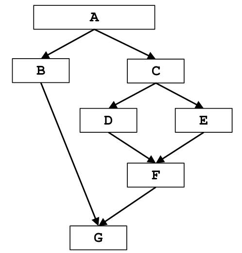

# Dominator Analysis


## Control Flow Graph

</img>

## Formalizzazione

| Parameter               | Value                                                            |
|-------------------------|------------------------------------------------------------------|
| Domain                  | Sets of BasicBlocks                                              |
| Direction               | <b>Forward:</b> <br>Out[B] = fB(In[B])<br>In[b] = ∩ Out[pred(B)] |
| Transfer function       | fB(In[B]) = Gen[B] U In[B]                                       |
| Meet Operation(∧)       | Intersezione(∩)                                                  |
| Boundary Condition      | Out[Entry] = {Entry}                                             |
| Initial Interior points | Out[B] = "Universal Set"                                         |

## Pseudocode

```python

#Boundary condition
out[Entry] = {Entry}

#Initialization for iterative algorithm
for each basic_block_B other than Exit
    out[B] = "Universal Set"
    
#Iterate
while (Changes to any out[] occur):
    for each basic_block_B other than Entry:
        in[B] = ∩ (out[s]), for all predecessor s of B
        out[B] = fB(in[B]) # trasfer function

# If reached = Convergence
```

## Iterazioni algoritmo


### Gen and Kill table

|  BasicBlock | Gen  | Kill |
|:---:|:-----:|:----:|
| A | A  |   -  |
| B | B  |   -  |
| C | C  |   -  |
| D | D  |   -  |
| E | E  |   -  |
| F | F  |   -  |
| G | G  |   -  |

### Iterations

⚬ From Iteration1 to Iteration2 there are no differences

|            | Iterazione1 | Iterazione1 |   | Iterazione2 | Iterazione2 |
|:----------:|:-----------:|:-----------:|:---:|:-----------:|:-----------:|
| BasicBlock | IN[B]       | OUT[B]      |   | IN[B]       | OUT[B]      |
| A          | ∅           | A           |   | ∅           | A           |
| B          | A           | A,B         |   | A           | A,B         |
| C          | A           | A,C         |   | A           | A,C         |
| D          | A,C         | A,C,D       |   | A,C         | A,C,D       |
| E          | A,C         | A.C,E       |   | A,C         | A.C,E       |
| F          | A,C         | A,C,F       |   | A,C         | A,C,F       |
| G          | A           | A,G         |   | A           | A,G         |


### Iterations - bit vector

⚬ We can also rappresent the iteration with a bit vector, the vector size is equal to |BasicBlocks| (in this examples |BB| = 7).  
&emsp; Each position rappresents one BasicBlock and if it is set to 1 it means it is include in the set.


|            | Iterazione1     | Iterazione1     |   | Iterazione2     | Iterazione2     |
|:----------:|:---------------:|:---------------:|:---:|:---------------:|:---------------:|
| BasicBlock | IN[B]           | OUT[B]          |   | IN[B]           | OUT[B]          |
| A          | <0,0,0,0,0,0,0> | <1,0,0,0,0,0,0> |   | <0,0,0,0,0,0,0> | <1,0,0,0,0,0,0> |
| B          | <1,0,0,0,0,0,0> | <1,1,0,0,0,0,0> |   | <1,0,0,0,0,0,0> | <1,1,0,0,0,0,0> |
| C          | <1,0,0,0,0,0,0> | <1,0,1,0,0,0,0> |   | <1,0,0,0,0,0,0> | <1,0,1,0,0,0,0> |
| D          | <1,0,1,0,0,0,0> | <1,0,1,1,0,0,0> |   | <1,0,1,0,0,0,0> | <1,0,1,1,0,0,0> |
| E          | <1,0,1,0,0,0,0> | <1,0,1,0,1,0,0> |   | <1,0,1,0,0,0,0> | <1,0,1,0,1,0,0> |
| F          | <1,0,1,0,0,0,0> | <1,0,1,0,0,1,0> |   | <1,0,1,0,0,0,0> | <1,0,1,0,0,1,0> |
| G          | <1,0,0,0,0,0,0> | <1,0,0,0,0,0,1> |   | <1,0,0,0,0,0,0> | <1,0,0,0,0,0,1> |

