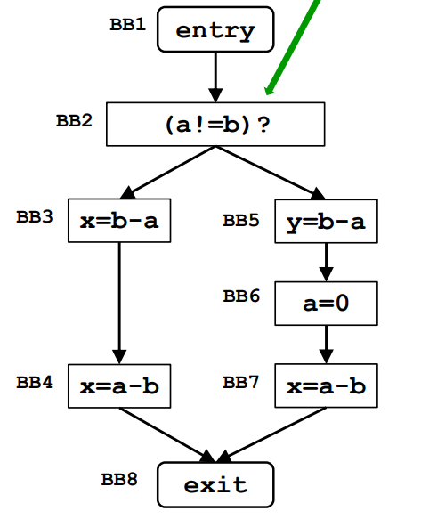

# Very Busy Expressions

</img>

## 1. Table

| Parameter               |                         Value                                          |
|-------------------------|:-----------------------------------------------------------------------|
| Domain                  | Sets of expressions                                                    |
| Direction               | Backward:   in[b] = f_b(out[b])   out[b] = $\wedge$ in[succ(b)]  |
| Transfer function       | f_b(x) = $Gen_b$ $\cup$ $(out_b – Kill_b)$                             |
| Meet operation (∧)      | $\cap$                                                                 |
| Boundary condition      | in[exit] = $\emptyset$                                                  |
| Initial interior points | in[b] = U                                                              |

## Iterazioni algoritmo

### Gen and Kill table

|     | Gen   | Kill |
|-----|-------|------|
| BB2 |       |      |
| BB3 | b-a   |      |
| BB4 | a-b   |      |
| BB5 | b-a   |      |
| BB6 |       | a-b , b-a |
| BB7 | b-a   |      |
| BB8 |       |      |

### Iterations

|     | Iterazione1 | Iterazione1 |     | Iterazione2 | Iterazione2 |
|-----|-------------|-------------|-----|-------------|-------------|
|     | IN[b]       | Out[b]      |     | IN[b]       | Out[b]      |
| BB2 | b-a         | b-a         |     | b-a         | b-a         |
| BB3 | (b-a),(a-b) | a-b         |     | (b-a),(a-b) | a-b         |
| BB4 | a-b         | Ø           |     | a-b         | Ø           |
| BB5 | b-a         | Ø           |     | b-a         | Ø           |
| BB6 | Ø           | a-b         |     | Ø           | a-b         |
| BB7 | a-b         | Ø           |     | a-b         | Ø           |
| BB8 | Ø           |             |     | Ø           |             |
