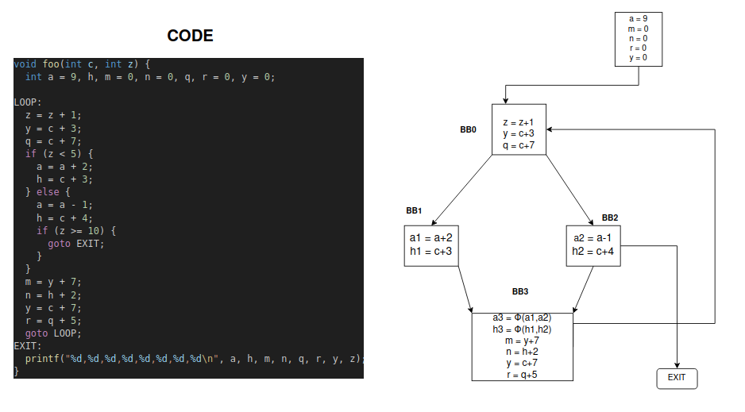
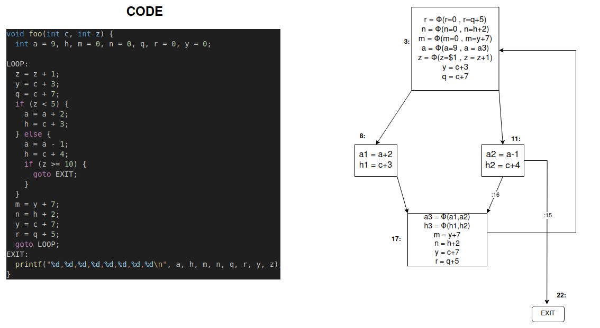

# Assignment 3

## Consegna

A partire dal codice della esercitazione 4, implementare un passo di Loop-Invariant Code Motion (LICM).

## Rappresentazione grafica del problema

### Control Flow Graph of .ll code (No mem2reg opt)  --- [C style]

</img>  

  

---

### Control Flow Graph of .ll code (with mem2reg opt)  --- [C style]

 

</img>

  

### Control Flow Graph of .ll code (with mem2reg opt) --- [IR style]

 

</img>   
   

## Algoritmo per la Code Motion 

• Dato un insieme di nodi in un loop: 

1. Calcolare le <b>reaching definitions</b>.

2. Trovare le istruzioni <b>loop-invariant</b>.
   
3. Calcolare i <b>dominatori</b> (dominance tree)

4. Trovare le <b>uscite del loop</b> (i successori fuori dal loop)
   
5. Trovare le <b>istruzioni candidate alla code motion</b>:              (le condizioni devono essere tutte vere)
   1. Sono loop invariant
   2. Si trovano in blocchi che dominano tutte le uscite del loop <b>OPPURE</b> la variabile definita dall’istruzione è dead all’uscita del loop.
   3. Assegnano un valore a variabili non assegnate altrove nel loop
   4. Si trovano in blocchi che dominano tutti i blocchi nel loop che usano la variabile a cui si sta assegnando un valore

6. Eseguire una ricerca <b>depth-first</b> dei blocchi

7. Spostare l’istruzione candidata nel <b>preheader</b> se tutte le istruzioni
invarianti da cui questa dipende sono state spostate.

