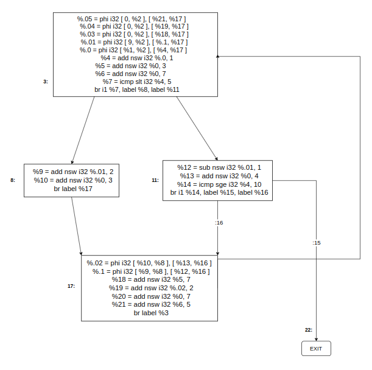

# <center> Assignment 3 </center>

## Consegna:

A partire dal codice dell'esercitazione 4, implementare un passo di Loop-Invariant Code Motion (LICM).

### Codice Sorgente:

```c++
#include <stdio.h>

void foo(int c, int z)
{
  int a = 9, h, m = 0, n = 0, q, r = 0, y = 0;

LOOP:
  z = z + 1;
  y = c + 3;
  q = c + 7;
  if (z < 5)
  {
    a = a + 2;
    h = c + 3;
  }
  else
  {
    a = a - 1;
    h = c + 4;
    if (z >= 10)
    {
      goto EXIT;
    }
  }
  m = y + 7;
  n = h + 2;
  y = c + 7;
  r = q + 5;
  goto LOOP;
EXIT:
  printf("%d,%d,%d,%d,%d,%d,%d,%d\n", a, h, m, n, q, r, y, z);
}

int main()
{
  foo(0, 4);
  foo(0, 12);
  return 0;
}

```

<br><br>

## Rappresentazione grafica del problema:

### 1. Control Flow Graph of the source code (No opt passes)

<br>


<br><br>

---

### 2. Control Flow Graph with `mem2reg` pass invoked

<br>



<br><br>


### 3. Control Flow Graph with `mem2reg` pass invoked  (highlight the CM instructions)

<br>


<br><br>


## Algoritmo per la Code Motion

• Dato un insieme di nodi in un loop:

1. Calcolare le <b>reaching definitions</b>.

2. Trovare le istruzioni <b>loop-invariant</b>.
3. Calcolare i <b>dominatori</b> (dominance tree)

4. Trovare le <b>uscite del loop</b> (i successori fuori dal loop)
5. Trovare le <b>istruzioni candidate alla code motion</b>: (le condizioni devono essere tutte vere)

   - Sono loop invariant
   - Si trovano in blocchi che dominano tutte le uscite del loop <b>OPPURE</b> la variabile definita dall’istruzione è dead all’uscita del loop.
   - Assegnano un valore a variabili non assegnate altrove nel loop
   - Si trovano in blocchi che dominano tutti i blocchi nel loop che usano la variabile a cui si sta assegnando un valore

6. Eseguire una ricerca <b>depth-first</b> dei blocchi

7. Spostare l’istruzione candidata nel <b>preheader</b> se tutte le istruzioni
   invarianti da cui questa dipende sono state spostate.
