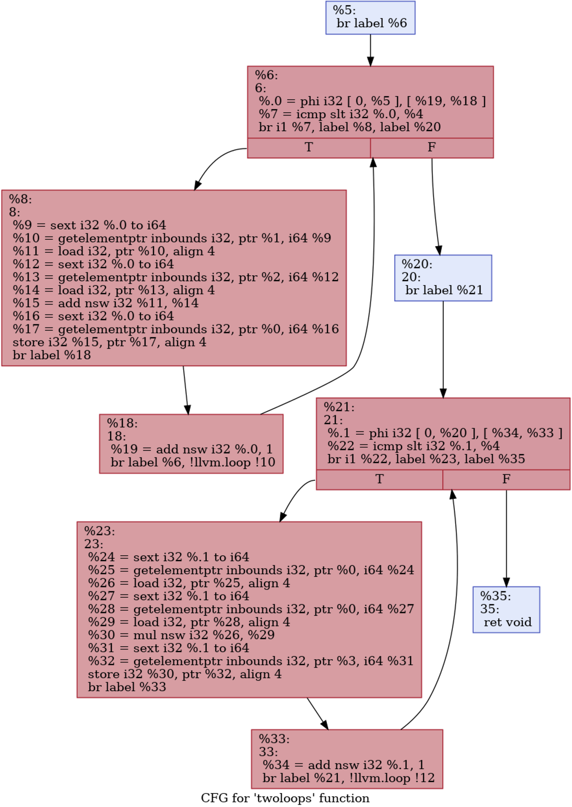

# 
 Assignment 4 

## Consegna:

• Implementare un passo di Loop Fusion.

## Definition

A loop is a subset of nodes from the control-flow graph (CFG; where nodes represent basic blocks) with the following properties:

1. The induced subgraph (which is the subgraph that contains all the edges from the CFG within the loop) is strongly connected (every node is reachable from all others).

2. All edges from outside the subset into the subset point to the same node, called the header. As a consequence, the header dominates all nodes in the loop (i.e. every execution path to any of the loop’s node will have to pass through the header).

3. The loop is the maximum subset with these properties. That is, no additional nodes from the CFG can be added such that the induced subgraph would still be strongly connected and the header would remain the same.

## Terminology

</img>

1. An <b>entering block</b> (or loop predecessor) is a non-loop node that has an edge into the loop (necessarily the header). If there is only one entering block, and its only edge is to the header, it is also called the loop’s preheader. The preheader dominates the loop without itself being part of the loop.

2. A <b>latch</b> is a loop node that has an edge to the header.

3. A <b>backedge</b> is an edge from a latch to the header.

4. An <b>exiting edge</b> is an edge from inside the loop to a node outside of the loop. The source of such an edge is called an exiting block, its target is an exit block. 

## Important notes

- A node can be the header of at most one loop. As such, a loop can be <b>identified by its header</b>.
  
- For basic blocks that are not reachable from the function’s entry, the concept of loops is undefined. 

- The smallest loop consists of a <b>single basic block</b> that branches to itself.

    </img>

- Nested Loop: 

    </img>

- The number of executions of the loop header before leaving the loop is the <b>loop trip count</b> (or iteration count). If the loop should not be executed at all, a <b>loop guard</b> must skip the entire loop:
    
    </img>

## Loop Simplify Form

The <b>Loop Simplify Form</b> is a canonical form that makes several analyses and transformations simpler and more effective. It is ensured by the LoopSimplify. The loop has:

- A preheader.

- A single backedge (which implies that there is a single latch).

- Dedicated exits. That is, no exit block for the loop has a predecessor that is outside the loop. This implies that all exit blocks are dominated by the loop header.

## Algoritmo per la Loop Fusion

## CFG del codice IR:

